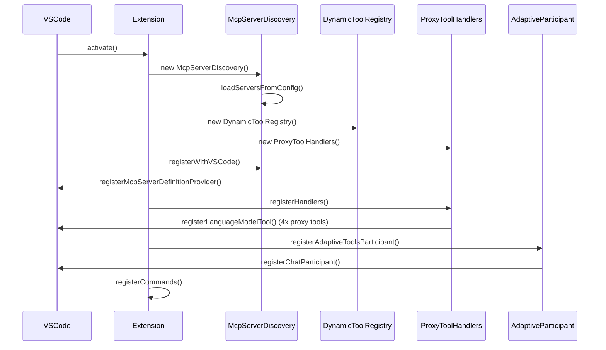
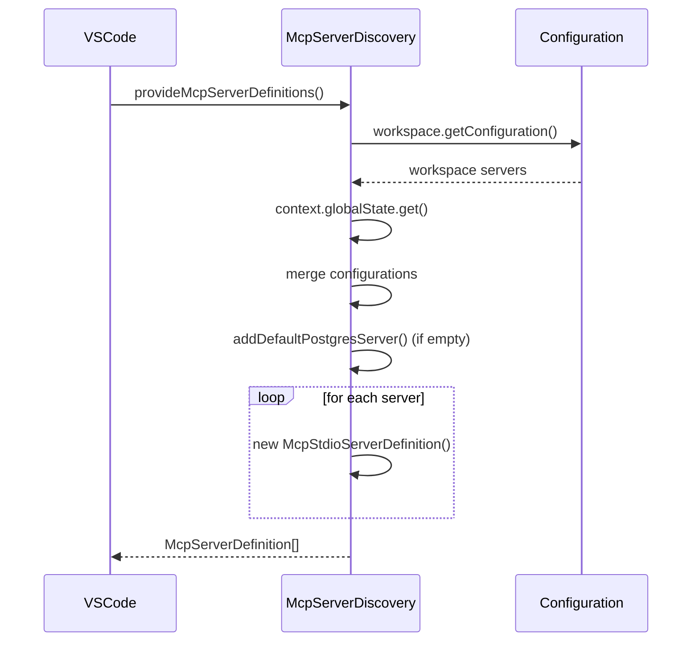
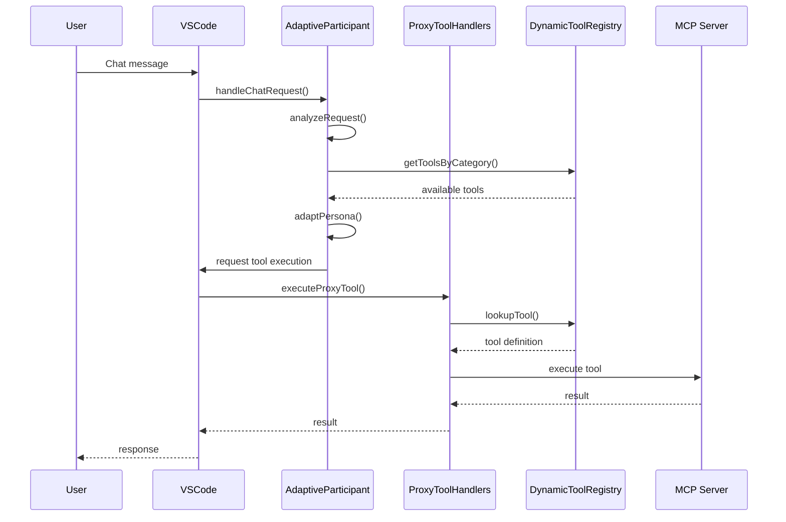
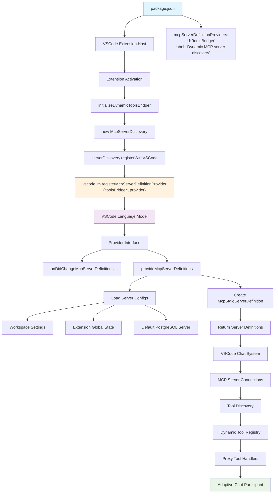

# Adaptive Tools Bridger - Technical Documentation

## Overview

The Adaptive Tools Bridger is a VSCode extension that provides dynamic MCP (Model Context Protocol) server discovery and management, enabling adaptive chat participants that change behavior based on available tools. This document covers the technical architecture, implementation details, and internal workflows.

## Architecture Overview

### High-Level Architecture

```
┌─────────────────────────────────────────────────────────────────────────────┐
│                            VSCode Extension Host                              │
├─────────────────────────────────────────────────────────────────────────────┤
│                        Extension Activation Layer                            │
├─────────────────────────────────────────────────────────────────────────────┤
│  ┌────────────────┐  ┌─────────────────┐  ┌────────────────┐  ┌─────────────┐ │
│  │ MCP Server     │  │ Dynamic Tool    │  │ Proxy Tool     │  │ Adaptive    │ │
│  │ Discovery      │  │ Registry        │  │ Handlers       │  │ Participant │ │
│  └────────────────┘  └─────────────────┘  └────────────────┘  └─────────────┘ │
├─────────────────────────────────────────────────────────────────────────────┤
│                        VSCode Language Model API                             │
├─────────────────────────────────────────────────────────────────────────────┤
│  ┌────────────────┐  ┌─────────────────┐  ┌────────────────┐  ┌─────────────┐ │
│  │ MCP Server     │  │ Language Model  │  │ Chat           │  │ Tool        │ │
│  │ Connections    │  │ Tools           │  │ Participants   │  │ Execution   │ │
│  └────────────────┘  └─────────────────┘  └────────────────┘  └─────────────┘ │
└─────────────────────────────────────────────────────────────────────────────┘
```

### Core Components

1. **MCP Server Discovery** (`mcpServerDiscovery.ts`): Manages MCP server configuration and discovery
2. **Dynamic Tool Registry** (`dynamicToolRegistry.ts`): Discovers and catalogs tools from connected MCP servers
3. **Proxy Tool Handlers** (`proxyToolHandlers.ts`): Handles execution of proxy tools that route to MCP servers
4. **Adaptive Participant** (`adaptiveParticipant.ts`): Intelligent chat participant that adapts based on available tools

## Project Structure

```
VSCodeToolBridger/
├── src/
│   ├── extension.ts              # Main extension entry point
│   ├── mcpServerDiscovery.ts     # MCP server discovery and management
│   ├── dynamicToolRegistry.ts    # Tool discovery and registry
│   ├── proxyToolHandlers.ts      # Proxy tool execution routing
│   └── adaptiveParticipant.ts    # Adaptive chat participant
├── package.json                  # Extension manifest and configuration
├── README.md                     # User documentation
├── TECHNICAL-DOCUMENTATION.md    # This file
└── out/                          # Compiled JavaScript output
```

## Component Details

### 1. MCP Server Discovery (`mcpServerDiscovery.ts`)

**Purpose**: Manages MCP server configuration, discovery, and registration with VSCode's language model system.

**Key Interfaces**:
```typescript
interface McpServerConfig {
    id: string;
    label: string;
    command: string;
    args?: string[];
    env?: Record<string, string>;
    participantId?: string;
    categories?: string[];
}
```

**Key Methods**:
- `provideMcpServerDefinitions()`: Returns array of `vscode.McpServerDefinition` objects
- `onDidChangeMcpServerDefinitions`: Event fired when server list changes
- `addServer()`: Adds new MCP server configuration
- `removeServer()`: Removes MCP server configuration
- `loadServersFromConfig()`: Loads servers from workspace and global settings

**Configuration Sources**:
1. **Workspace Settings**: `toolsBridger.mcpServers` configuration
2. **Extension Global State**: User-added servers via commands
3. **Default Configuration**: PostgreSQL server if none configured

### 2. Dynamic Tool Registry (`dynamicToolRegistry.ts`)

**Purpose**: Discovers and catalogs tools from connected MCP servers, providing a centralized registry for tool lookup and execution.

**Key Interfaces**:
```typescript
interface DynamicTool {
    name: string;
    description: string;
    inputSchema: any;
    serverId: string;
    participantId: string;
    category: string;
    confidence: number;
}
```

**Key Methods**:
- `discoverTools()`: Discovers tools from all connected MCP servers
- `getToolsByCategory()`: Returns tools filtered by category
- `getToolsByParticipant()`: Returns tools for specific participant
- `executePrivateTool()`: Executes tools directly without global registration

**Tool Categorization**:
- Database operations (query, schema, modify)
- File system operations (read, write, search)
- Analysis and reporting
- General utility functions

### 3. Proxy Tool Handlers (`proxyToolHandlers.ts`)

**Purpose**: Provides proxy tools that route execution to appropriate MCP servers based on tool name and category.

**Proxy Tool Types**:
1. **Database Proxy** (`tool_proxy_database`): Routes database-related operations
2. **Query Proxy** (`tool_proxy_query`): Routes search and query operations
3. **Analysis Proxy** (`tool_proxy_analysis`): Routes analysis and reporting operations
4. **General Proxy** (`tool_proxy_general`): Routes general utility operations

**Execution Flow**:
```
User Request → Proxy Tool → Tool Lookup → MCP Server Execution → Response
```

**Key Methods**:
- `executeProxyTool()`: Main routing logic for proxy tool execution
- `routeToMcpServer()`: Routes request to appropriate MCP server
- `validateToolRequest()`: Validates tool parameters and permissions

### 4. Adaptive Participant (`adaptiveParticipant.ts`)

**Purpose**: Intelligent chat participant that analyzes user requests and adapts its persona based on available tools and detected domain expertise.

**Domain Detection**:
- **Database**: SQL queries, schema operations, data analysis
- **File System**: File operations, directory management, search
- **Git**: Version control operations, repository management
- **Web**: HTTP requests, API calls, web scraping
- **Development**: Code analysis, build tools, testing
- **Analysis**: Data processing, reporting, visualization
- **System**: System administration, monitoring, configuration
- **Security**: Authentication, encryption, audit
- **Communication**: Messaging, notifications, collaboration

**Adaptive Behavior**:
1. **Request Analysis**: Analyzes user message for domain indicators
2. **Tool Matching**: Matches detected domains to available tools
3. **Persona Generation**: Generates appropriate expert persona
4. **Response Adaptation**: Adapts response style and capabilities

## Call Flow Diagrams

### 1. Extension Activation Flow



### 2. MCP Server Discovery Flow



### 3. Tool Discovery and Execution Flow



## MCP Integration Details

### MCP Server Definition Provider Flow

The following diagram illustrates the complete flow of how `mcpServerDefinitionProviders` works from declaration to execution:



### MCP Server Definition Provider Implementation

The extension implements the `vscode.McpServerDefinitionProvider` interface:

```typescript
interface McpServerDefinitionProvider {
    onDidChangeMcpServerDefinitions: vscode.Event<void>;
    provideMcpServerDefinitions(): Promise<vscode.McpServerDefinition[]>;
}
```

**Registration Process**:
1. Declare in `package.json` under `contributes.mcpServerDefinitionProviders`
2. Register with VSCode using `vscode.lm.registerMcpServerDefinitionProvider()`
3. Provide dynamic server definitions via `provideMcpServerDefinitions()`

### Tool Execution Routing

The extension uses a hybrid approach for tool execution:

1. **Static Proxy Tools**: Registered in `package.json` as `languageModelTools`
2. **Dynamic Tool Discovery**: Runtime discovery of actual MCP tools
3. **Routing Logic**: Proxy tools route to appropriate MCP server based on tool name

## Extension Lifecycle

### 1. Activation Events
- `onLanguage:*`: Activate for any language
- `onStartupFinished`: Activate when VSCode startup is complete

### 2. Initialization Sequence
1. Create MCP server discovery instance
2. Load server configurations from multiple sources
3. Register MCP server definition provider
4. Initialize dynamic tool registry
5. Register proxy tool handlers
6. Register adaptive chat participant
7. Register management commands

### 3. Runtime Operations
- Monitor configuration changes
- Discover new tools from connected servers
- Route proxy tool executions to appropriate servers
- Adapt participant behavior based on available tools

### 4. Deactivation
- Clean up tool registry resources
- Dispose of event listeners and subscriptions

## Configuration Management

### Workspace Configuration
```json
{
  "toolsBridger.mcpServers": [
    {
      "id": "my-server",
      "label": "My MCP Server",
      "command": "node",
      "args": ["server.js"],
      "env": {"KEY": "value"},
      "participantId": "myTools",
      "categories": ["database", "analysis"]
    }
  ]
}
```

### Extension Global State
- User-added servers via command palette
- Persistent across workspace changes
- Merged with workspace configuration

## Error Handling and Resilience

### 1. Server Connection Failures
- Graceful degradation when servers fail to connect
- Fallback to available servers for similar operations
- Clear error messages and recovery suggestions

### 2. Tool Execution Errors
- Proper error propagation from MCP servers
- Fallback to alternative tools when possible
- User-friendly error messages with troubleshooting tips

### 3. Configuration Validation
- Validate server configurations before registration
- Handle malformed or incomplete configurations
- Provide clear feedback for configuration issues

## Performance Considerations

### 1. Lazy Loading
- Tools are discovered only when first needed
- Server connections are established on-demand
- Minimal startup overhead

### 2. Caching Strategy
- Cache tool definitions to avoid repeated discovery
- Invalidate cache when server configurations change
- Efficient lookup structures for tool routing

### 3. Resource Management
- Proper cleanup of MCP server connections
- Dispose of event listeners and subscriptions
- Memory-efficient tool storage and retrieval

## Security Considerations

### 1. MCP Server Validation
- Validate server commands and arguments
- Restrict execution to configured servers only
- Sanitize user inputs before passing to MCP servers

### 2. Tool Permission Model
- Respect VSCode's security model for language model tools
- Proper validation of tool parameters
- Secure communication with MCP servers

### 3. Configuration Security
- Validate configuration inputs
- Prevent injection attacks in server commands
- Secure storage of sensitive configuration data

## Testing and Validation

### 1. Unit Testing
- Test individual component functionality
- Mock MCP server interactions
- Validate configuration loading and parsing

### 2. Integration Testing
- Test MCP server discovery and connection
- Validate tool execution routing
- Test adaptive participant behavior

### 3. End-to-End Testing
- Test complete user workflows
- Validate error handling and recovery
- Test configuration management

## Development Workflow

### 1. Development Environment Setup
```bash
npm install
npm run compile
npm run watch  # For development with hot reload
```

### 2. Testing
```bash
npm test
npm run lint
```

### 3. Packaging
```bash
npm run package  # Creates .vsix file
```

### 4. Extension Installation
```bash
code --install-extension *.vsix
```

## Troubleshooting Guide

### Common Issues

1. **MCP Server Connection Failures**
   - Check server command and arguments
   - Verify environment variables
   - Review server logs for detailed error messages

2. **Tool Discovery Issues**
   - Ensure MCP server is properly configured
   - Check server compatibility with MCP protocol
   - Verify tool definitions are valid

3. **Proxy Tool Execution Errors**
   - Validate tool name and parameters
   - Check MCP server responsiveness
   - Review proxy tool routing logic

## Extension Points and Customization

### 1. Custom MCP Servers
- Implement MCP protocol for custom functionality
- Register servers via workspace configuration
- Extend tool categories and capabilities

### 2. Custom Participant Behavior
- Modify adaptive participant logic
- Add new domain detection patterns
- Customize persona generation

### 3. Custom Tool Routing
- Extend proxy tool handlers
- Add new tool categories
- Implement custom execution logic

## Contributing

### 1. Code Structure
- Follow TypeScript best practices
- Use consistent naming conventions
- Document complex logic with comments

### 2. Testing Requirements
- Unit tests for new functionality
- Integration tests for MCP interactions
- End-to-end tests for user workflows

### 3. Documentation
- Update technical documentation for architectural changes
- Update user documentation for new features
- Include inline code documentation

## Future Enhancements

### 1. Advanced Tool Discovery
- Automatic tool categorization using ML
- Intelligent tool recommendation
- Dynamic tool composition

### 2. Enhanced Adaptive Behavior
- Learning from user interactions
- Personalized response styles
- Context-aware tool selection

### 3. Performance Optimization
- Async tool discovery and execution
- Efficient caching strategies
- Optimized tool routing algorithms

### 4. Extended Protocol Support
- Support for additional MCP protocol features
- Enhanced security and authentication
- Improved error handling and resilience

## Conclusion

The Adaptive Tools Bridger represents a sophisticated approach to dynamic tool integration in VSCode. By leveraging MCP server discovery, proxy tool routing, and adaptive participant behavior, it provides a flexible and extensible platform for tool integration that adapts to the user's needs and available capabilities.

The architecture is designed for extensibility, maintainability, and performance, making it suitable for both simple tool integration scenarios and complex multi-domain workflows. The comprehensive error handling and configuration management ensure reliable operation in diverse environments.

This technical documentation provides the foundation for understanding, maintaining, and extending the Adaptive Tools Bridger extension. For user-focused documentation, please refer to the README.md file. 