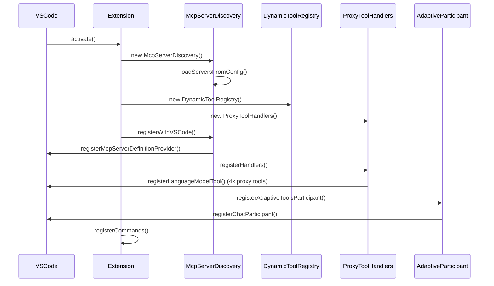
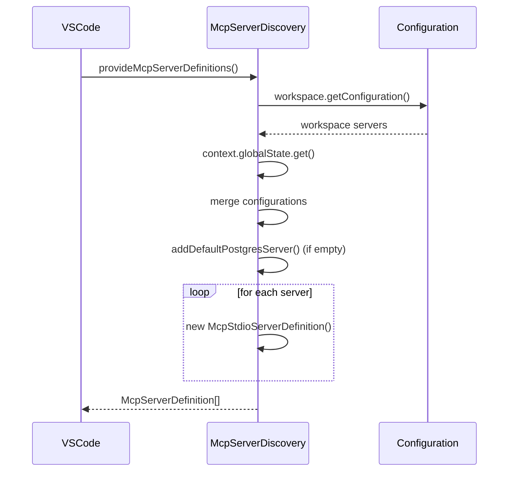
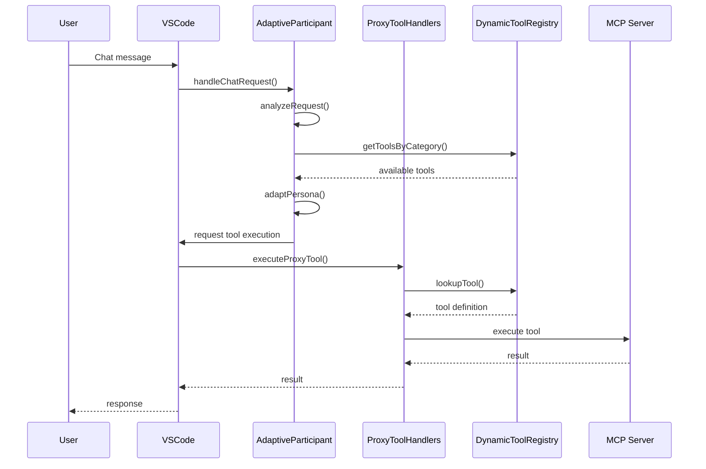
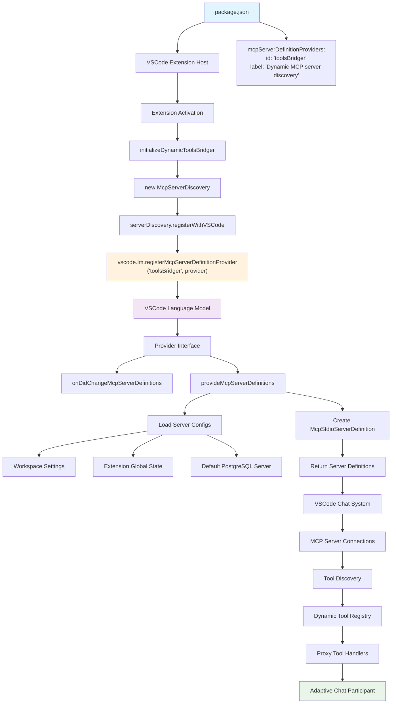

# Adaptive Tools Bridger - Technical Documentation

## Overview

The Adaptive Tools Bridger is a VSCode extension that provides dynamic MCP (Model Context Protocol) server discovery and management, enabling adaptive chat participants that change behavior based on available tools. This document covers the technical architecture, implementation details, and internal workflows.

## Architecture Overview

### High-Level Architecture

```
┌─────────────────────────────────────────────────────────────────────────────┐
│                            VSCode Extension Host                              │
├─────────────────────────────────────────────────────────────────────────────┤
│                        Extension Activation Layer                            │
├─────────────────────────────────────────────────────────────────────────────┤
│  ┌────────────────┐  ┌─────────────────┐  ┌────────────────┐  ┌─────────────┐ │
│  │ MCP Server     │  │ Dynamic Tool    │  │ Proxy Tool     │  │ Adaptive    │ │
│  │ Discovery      │  │ Registry        │  │ Handlers       │  │ Participant │ │
│  └────────────────┘  └─────────────────┘  └────────────────┘  └─────────────┘ │
├─────────────────────────────────────────────────────────────────────────────┤
│                        VSCode Language Model API                             │
├─────────────────────────────────────────────────────────────────────────────┤
│  ┌────────────────┐  ┌─────────────────┐  ┌────────────────┐  ┌─────────────┐ │
│  │ MCP Server     │  │ Language Model  │  │ Chat           │  │ Tool        │ │
│  │ Connections    │  │ Tools           │  │ Participants   │  │ Execution   │ │
│  └────────────────┘  └─────────────────┘  └────────────────┘  └─────────────┘ │
└─────────────────────────────────────────────────────────────────────────────┘
```

### Core Components

1. **MCP Server Discovery** (`mcpServerDiscovery.ts`): Manages MCP server configuration and discovery
2. **Dynamic Tool Registry** (`dynamicToolRegistry.ts`): Discovers and catalogs tools from connected MCP servers
3. **Proxy Tool Handlers** (`proxyToolHandlers.ts`): Handles execution of proxy tools that route to MCP servers
4. **Adaptive Participant** (`adaptiveParticipant.ts`): Intelligent chat participant that adapts based on available tools

## Project Structure

```
VSCodeToolBridger/
├── src/
│   ├── extension.ts              # Main extension entry point
│   ├── mcpServerDiscovery.ts     # MCP server discovery and management
│   ├── dynamicToolRegistry.ts    # Tool discovery and registry
│   ├── proxyToolHandlers.ts      # Proxy tool execution routing
│   └── adaptiveParticipant.ts    # Adaptive chat participant
├── package.json                  # Extension manifest and configuration
├── README.md                     # User documentation
├── TECHNICAL-DOCUMENTATION.md    # This file
└── out/                          # Compiled JavaScript output
```

## Component Details

### 1. MCP Server Discovery (`mcpServerDiscovery.ts`)

**Purpose**: Manages MCP server configuration, discovery, and registration with VSCode's language model system.

**Key Interfaces**:
```typescript
interface McpServerConfig {
    id: string;
    label: string;
    transport: 'stdio' | 'streamable' | 'sse';
    
    // For stdio transport
    command?: string;
    args?: string[];
    env?: Record<string, string>;
    
    // For HTTP-based transports (streamable/sse)
    url?: string;
    
    // Internal use only - not exposed to user configuration
    participantId?: string;
    categories?: string[];
}
```

**Key Methods**:
- `provideMcpServerDefinitions()`: Returns array of `vscode.McpServerDefinition` objects (currently stdio only)
- `onDidChangeMcpServerDefinitions`: Event fired when server list changes
- `addServer()`: Adds new MCP server configuration
- `removeServer()`: Removes MCP server configuration
- `loadServersFromConfig()`: Loads servers from workspace and global settings

**Transport Support**:
- **stdio**: Creates `McpStdioServerDefinition` instances
- **streamable**: Framework ready, awaiting VSCode API support for `McpStreamableServerDefinition`
- **sse**: Framework ready, awaiting VSCode API support for `McpSSEServerDefinition`

**Configuration Sources**:
1. **Workspace Settings**: `toolsBridger.mcpServers` configuration
2. **Extension Global State**: User-added servers via commands
3. **Default Configuration**: PostgreSQL server if none configured

**Transport Support**:
- **stdio** (✅ Currently Supported): Local MCP servers via process communication
- **streamable** (🚧 Coming Soon): HTTP-based MCP servers with streaming support
- **sse** (🚧 Coming Soon): Server-Sent Events for real-time streaming data

**Note**: All MCP servers use the single adaptive participant `adaptive-tools-participant.toolsAgent` regardless of configuration.

### 2. Dynamic Tool Registry (`dynamicToolRegistry.ts`)

**Purpose**: Discovers and catalogs tools from connected MCP servers, providing a centralized registry for tool lookup and execution.

**Key Interfaces**:
```typescript
interface DynamicTool {
    name: string;
    description: string;
    inputSchema: any;
    serverId: string;
    participantId: string;
    category: string;
    confidence: number;
}
```

**Key Methods**:
- `discoverTools()`: Discovers tools from all connected MCP servers
- `getToolsByCategory()`: Returns tools filtered by category
- `getToolsByParticipant()`: Returns tools for specific participant
- `executePrivateTool()`: Executes tools directly without global registration

**Tool Categorization**:
- Database operations (query, schema, modify)
- File system operations (read, write, search)
- Analysis and reporting
- General utility functions

### 3. Proxy Tool Handlers (`proxyToolHandlers.ts`)

**Purpose**: Provides proxy tools that route execution to appropriate MCP servers based on tool name and category.

**Proxy Tool Types**:
1. **Database Proxy** (`tool_proxy_database`): Routes database-related operations
2. **Query Proxy** (`tool_proxy_query`): Routes search and query operations
3. **Analysis Proxy** (`tool_proxy_analysis`): Routes analysis and reporting operations
4. **General Proxy** (`tool_proxy_general`): Routes general utility operations

**Note**: Proxy tools are registered using the `name` field from package.json (e.g., `tool_proxy_database`) rather than `toolReferenceName` (e.g., `proxyDatabase`) to ensure proper VSCode tool discovery.

**Execution Flow**:
```
User Request → Proxy Tool → Tool Lookup → MCP Server Execution → Response
```

**Key Methods**:
- `executeProxyTool()`: Main routing logic for proxy tool execution
- `routeToMcpServer()`: Routes request to appropriate MCP server
- `validateToolRequest()`: Validates tool parameters and permissions

### 4. Adaptive Participant (`adaptiveParticipant.ts`)

**Purpose**: Intelligent chat participant that analyzes user requests and adapts its persona based on available tools and detected domain expertise.

**Domain Detection**:
- **Database**: SQL queries, schema operations, data analysis
- **File System**: File operations, directory management, search
- **Git**: Version control operations, repository management
- **Web**: HTTP requests, API calls, web scraping
- **Development**: Code analysis, build tools, testing
- **Analysis**: Data processing, reporting, visualization
- **System**: System administration, monitoring, configuration
- **Security**: Authentication, encryption, audit
- **Communication**: Messaging, notifications, collaboration

**Adaptive Behavior**:
1. **Request Analysis**: Analyzes user message for domain indicators
2. **Tool Matching**: Matches detected domains to available tools
3. **Persona Generation**: Generates appropriate expert persona
4. **Response Adaptation**: Adapts response style and capabilities

## Call Flow Diagrams

### 1. Extension Activation Flow



### 2. MCP Server Discovery Flow



### 3. Tool Discovery and Execution Flow



## MCP Integration Details

### MCP Server Definition Provider Flow

The following diagram illustrates the complete flow of how `mcpServerDefinitionProviders` works from declaration to execution:



### MCP Server Definition Provider Implementation

The extension implements the `vscode.McpServerDefinitionProvider` interface:

```typescript
interface McpServerDefinitionProvider {
    onDidChangeMcpServerDefinitions: vscode.Event<void>;
    provideMcpServerDefinitions(): Promise<vscode.McpServerDefinition[]>;
}
```

**Registration Process**:
1. Declare in `package.json` under `contributes.mcpServerDefinitionProviders`
2. Register with VSCode using `vscode.lm.registerMcpServerDefinitionProvider()`
3. Provide dynamic server definitions via `provideMcpServerDefinitions()`

### Tool Execution Routing

The extension uses a hybrid approach for tool execution:

1. **Static Proxy Tools**: Registered in `package.json` as `languageModelTools`
2. **Dynamic Tool Discovery**: Runtime discovery of actual MCP tools
3. **Routing Logic**: Proxy tools route to appropriate MCP server based on tool name

## Extension Lifecycle

### 1. Activation Events
- `onLanguage:*`: Activate for any language
- `onStartupFinished`: Activate when VSCode startup is complete

### 2. Initialization Sequence
1. Create MCP server discovery instance
2. Load server configurations from multiple sources
3. Register MCP server definition provider
4. Initialize dynamic tool registry
5. Register proxy tool handlers
6. Register adaptive chat participant
7. Register management commands

### 3. Runtime Operations
- Monitor configuration changes
- Discover new tools from connected servers
- Route proxy tool executions to appropriate servers
- Adapt participant behavior based on available tools

### 4. Deactivation
- Clean up tool registry resources
- Dispose of event listeners and subscriptions

## Configuration Management

### Workspace Configuration

#### stdio Transport (Currently Supported)
```json
{
  "toolsBridger.mcpServers": [
    {
      "id": "my-server",
      "label": "My MCP Server",
      "transport": "stdio",
      "command": "node",
      "args": ["server.js"],
      "env": {"KEY": "value"},
      "categories": ["database", "analysis"]
    }
  ]
}
```

#### streamable Transport (Coming Soon)
```json
{
  "toolsBridger.mcpServers": [
    {
      "id": "remote-api",
      "label": "Remote API Server",
      "transport": "streamable",
      "url": "https://api.example.com/mcp",
      "categories": ["api", "web", "remote"]
    }
  ]
}
```

#### sse Transport (Coming Soon)
```json
{
  "toolsBridger.mcpServers": [
    {
      "id": "live-feed",
      "label": "Live Data Feed",
      "transport": "sse",
      "url": "https://stream.example.com/mcp/events",
      "categories": ["streaming", "real-time", "analytics"]
    }
  ]
}
```

### Extension Global State
- User-added servers via command palette
- Persistent across workspace changes
- Merged with workspace configuration

## Error Handling and Resilience

### 1. Server Connection Failures
- Graceful degradation when servers fail to connect
- Fallback to available servers for similar operations
- Clear error messages and recovery suggestions

### 2. Tool Execution Errors
- Proper error propagation from MCP servers
- Fallback to alternative tools when possible
- User-friendly error messages with troubleshooting tips

### 3. Configuration Validation
- Validate server configurations before registration
- Handle malformed or incomplete configurations
- Provide clear feedback for configuration issues

## Performance Considerations

### 1. Lazy Loading
- Tools are discovered only when first needed
- Server connections are established on-demand
- Minimal startup overhead

### 2. Caching Strategy
- Cache tool definitions to avoid repeated discovery
- Invalidate cache when server configurations change
- Efficient lookup structures for tool routing

### 3. Resource Management
- Proper cleanup of MCP server connections
- Dispose of event listeners and subscriptions
- Memory-efficient tool storage and retrieval

## Security Considerations

### 1. MCP Server Validation
- Validate server commands and arguments
- Restrict execution to configured servers only
- Sanitize user inputs before passing to MCP servers

### 2. Tool Permission Model
- Respect VSCode's security model for language model tools
- Proper validation of tool parameters
- Secure communication with MCP servers

### 3. Configuration Security
- Validate configuration inputs
- Prevent injection attacks in server commands
- Secure storage of sensitive configuration data

## Testing and Validation

### 1. Unit Testing
- Test individual component functionality
- Mock MCP server interactions
- Validate configuration loading and parsing

### 2. Integration Testing
- Test MCP server discovery and connection
- Validate tool execution routing
- Test adaptive participant behavior

### 3. End-to-End Testing
- Test complete user workflows
- Validate error handling and recovery
- Test configuration management

## Development Workflow

### 1. Development Environment Setup
```bash
npm install
npm run compile
npm run watch  # For development with hot reload
```

### 2. Testing
```bash
npm test
npm run lint
```

### 3. Packaging
```bash
npm run package  # Creates .vsix file
```

### 4. Extension Installation
```bash
code --install-extension *.vsix
```

## Troubleshooting Guide

### Common Issues

1. **MCP Server Connection Failures**
   - Check server command and arguments
   - Verify environment variables
   - Review server logs for detailed error messages

2. **Tool Discovery Issues**
   - Ensure MCP server is properly configured
   - Check server compatibility with MCP protocol
   - Verify tool definitions are valid

3. **Proxy Tool Execution Errors**
   - Validate tool name and parameters
   - Check MCP server responsiveness
   - Review proxy tool routing logic

## Extension Points and Customization

### 1. Custom MCP Servers
- Implement MCP protocol for custom functionality
- Register servers via workspace configuration
- Extend tool categories and capabilities

### 2. Custom Participant Behavior
- Modify adaptive participant logic
- Add new domain detection patterns
- Customize persona generation

### 3. Custom Tool Routing
- Extend proxy tool handlers
- Add new tool categories
- Implement custom execution logic

## Current Implementation Status

### Architecture Decisions

#### Pure Single Participant Approach (Implemented)
The extension currently implements a **Pure Single Participant** architecture where all MCP tools are accessed through a single adaptive chat participant (`@toolsAgent`). This design decision was made for:

**Benefits**:
- **Simplified User Experience**: Users only need to remember one participant ID
- **Consistent Interface**: All tools accessible through the same interface
- **Intelligent Adaptation**: Single participant adapts to different domains automatically
- **Reduced Complexity**: Simpler configuration and management

**Implementation Details**:
- Participant ID: `adaptive-tools-participant.toolsAgent`
- All MCP servers internally use this same participant ID
- User configuration does not expose `participantId` field
- Adaptive behavior based on tool categories and request analysis

#### Transport Support Status
- **stdio** (✅ **Fully Supported**): Local MCP servers via process communication
- **streamable** (🚧 **Framework Ready**): HTTP-based servers - awaiting VSCode API support
- **sse** (🚧 **Framework Ready**): Server-Sent Events - awaiting VSCode API support

#### Configuration Management
- **Workspace Settings**: Primary configuration source via `toolsBridger.mcpServers`
- **Command Palette**: Simplified server addition (stdio only)
- **Extension Global State**: Persistent user-added servers
- **Default Configuration**: PostgreSQL server for immediate functionality

#### Tool Registration Architecture
- **Proxy Tools**: Four proxy tools registered with VSCode (`tool_proxy_database`, `tool_proxy_query`, `tool_proxy_analysis`, `tool_proxy_general`)
- **Dynamic Discovery**: Runtime discovery of actual MCP tools
- **Intelligent Routing**: Proxy tools route to appropriate MCP servers based on categories and tool names
- **Graceful Degradation**: System functions even when MCP servers are unavailable

### Known Limitations

#### Transport Support
- Only stdio transport currently functional due to VSCode API limitations
- Streamable and SSE configurations accepted but not executable until VSCode adds API support
- No authentication support for remote servers yet

#### Participant Architecture
- Single participant may not provide domain-specific expertise as effectively as specialized participants
- No ability to create custom participants per project or domain
- All tools appear under one participant regardless of server source

#### Performance Constraints
- Tool discovery happens at runtime, causing potential delays
- No caching of tool definitions between sessions
- Proxy tool routing adds overhead to tool execution

#### Configuration Complexity
- Transport configuration ready but not fully functional
- No validation of remote server URLs or authentication
- Limited error feedback for configuration issues

### Recent Fixes and Improvements

#### ParticipantId Consistency (Fixed)
- **Issue**: Multiple different default participantId values across components
- **Solution**: Standardized on `adaptive-tools-participant.toolsAgent` throughout codebase
- **Impact**: Eliminated tool registration failures and "tool was not contributed" errors

#### Proxy Tool Registration (Fixed)
- **Issue**: Proxy tools registered with `toolReferenceName` instead of `name` from package.json
- **Solution**: Updated registration to use proper tool names (`tool_proxy_database`, etc.)
- **Impact**: Fixed tool discovery and execution routing

#### Transport Architecture (Implemented)
- **Addition**: Added transport field to `McpServerConfig` interface
- **Framework**: Implemented transport-aware server definition creation
- **Preparation**: Ready for future VSCode API enhancements

#### Configuration Schema (Enhanced)
- **Improvement**: Updated package.json with transport-aware configuration schema
- **User Experience**: Better IntelliSense and validation in settings
- **Documentation**: Clear indication of current vs. future transport support

## Contributing

### 1. Code Structure
- Follow TypeScript best practices
- Use consistent naming conventions
- Document complex logic with comments

### 2. Testing Requirements
- Unit tests for new functionality
- Integration tests for MCP interactions
- End-to-end tests for user workflows

### 3. Documentation
- Update technical documentation for architectural changes
- Update user documentation for new features
- Include inline code documentation

## Future Enhancements

### 1. HTTP Transport Support (High Priority)
- **streamable Transport**: Implement HTTP-based MCP server support when VSCode API adds `McpStreamableServerDefinition`
- **sse Transport**: Add Server-Sent Events support for real-time streaming MCP servers
- **Authentication**: Add support for API keys, OAuth, and other authentication methods for remote servers
- **Connection Management**: Implement connection pooling, retry logic, and health checks for remote servers

### 2. Multi-Participant Architecture (Optional)
- **Dynamic Participant Creation**: Create specialized chat participants per domain (e.g., `@dbTools`, `@gitTools`, `@webTools`)
- **Participant Specialization**: Domain-specific personas with expert knowledge and tool access
- **User Choice**: Allow users to choose between single adaptive participant or multiple specialized participants
- **Participant Management**: Commands to create, configure, and manage multiple participants

### 3. Advanced Tool Discovery
- **Intelligent Categorization**: Use ML to automatically categorize tools based on descriptions and usage patterns
- **Tool Recommendation**: Suggest relevant tools based on user context and project structure
- **Dynamic Tool Composition**: Chain tools together for complex workflows
- **Tool Dependencies**: Detect and manage tool dependencies and prerequisites

### 4. Enhanced Adaptive Behavior
- **Learning from Interactions**: Adapt responses based on user feedback and usage patterns
- **Personalized Response Styles**: Customize communication style based on user preferences
- **Context-Aware Selection**: Improve tool selection based on workspace context and file types
- **Proactive Suggestions**: Suggest tools and actions based on detected patterns and needs

### 5. Performance and Scalability
- **Async Tool Discovery**: Implement parallel tool discovery for faster startup
- **Intelligent Caching**: Cache tool definitions, server responses, and user preferences
- **Optimized Routing**: Improve proxy tool routing algorithms for better performance
- **Resource Management**: Better memory usage and connection lifecycle management

### 6. Security and Reliability
- **Enhanced Authentication**: Support for secure authentication with remote MCP servers
- **Input Validation**: Comprehensive validation of user inputs and server responses
- **Error Recovery**: Improved error handling with automatic retry and fallback mechanisms
- **Audit Logging**: Comprehensive logging for debugging and security auditing

### 7. Developer Experience
- **Tool Development Kit**: SDK for creating custom MCP servers and tools
- **Configuration Validation**: Real-time validation of server configurations with helpful error messages
- **Debug Mode**: Enhanced debugging capabilities for tool development and troubleshooting
- **Testing Framework**: Built-in testing tools for MCP server and tool validation

### 8. Integration Enhancements
- **VSCode Integration**: Deeper integration with VSCode features (file explorer, source control, etc.)
- **Extension Ecosystem**: Support for other extensions to register MCP servers and tools
- **Workspace Templates**: Predefined configurations for common development environments
- **Cloud Integration**: Support for cloud-based MCP servers and services

## Conclusion

The Adaptive Tools Bridger represents a sophisticated approach to dynamic tool integration in VSCode, successfully implementing a Pure Single Participant architecture that simplifies the user experience while maintaining powerful adaptability. The current implementation demonstrates several key achievements:

### Technical Achievements

1. **Robust Architecture**: The extension successfully combines MCP server discovery, proxy tool routing, and adaptive participant behavior into a cohesive system that handles diverse tool types and domains.

2. **User-Centric Design**: The Pure Single Participant approach eliminates complexity for users while maintaining intelligent domain adaptation through the `@toolsAgent` participant.

3. **Future-Ready Framework**: The transport-aware architecture is prepared for HTTP-based MCP servers, enabling seamless expansion when VSCode API support becomes available.

4. **Reliability**: Comprehensive error handling, graceful degradation, and robust configuration management ensure stable operation across various environments.

### Current State

The extension is production-ready with:
- **Stable stdio transport** for local MCP servers
- **Consistent tool registration** and execution
- **Intelligent routing** through proxy tools
- **Adaptive behavior** based on tool categories and user context
- **Comprehensive configuration** management

### Future Potential

The architectural foundation enables exciting future enhancements:
- **HTTP Transport Support**: Ready for streamable and SSE transports
- **Multi-Participant Option**: Framework supports specialized participants if needed
- **Enhanced Intelligence**: ML-based tool categorization and recommendation
- **Cloud Integration**: Support for remote MCP services and authentication

### Impact

This extension demonstrates how thoughtful architecture can bridge complex protocols (MCP) with user-friendly interfaces, creating a system that grows with both user needs and ecosystem capabilities. The balance between immediate functionality and future extensibility makes it a solid foundation for the evolving landscape of AI-powered development tools.

This technical documentation provides the foundation for understanding, maintaining, and extending the Adaptive Tools Bridger extension. For user-focused documentation, please refer to the README.md file. 